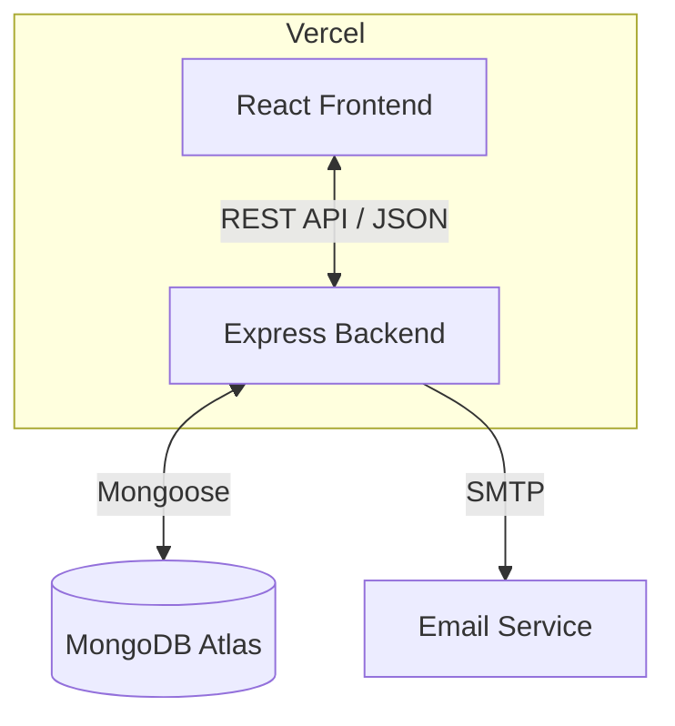
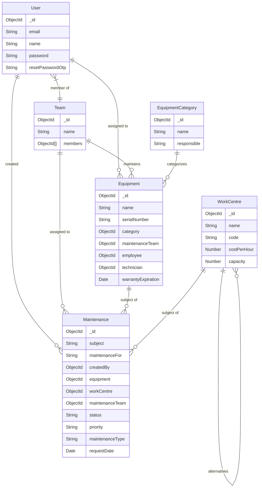

# GearGuard: The Ultimate Maintenance Tracker

GearGuard is a robust, full-stack web application designed to streamline maintenance operations for equipment and work centers. It allows organizations to track assets, manage maintenance teams, schedule repairs (Preventive/Corrective), and visualize workflows via a calendar and dashboard.

## 🚀 Features

-   **Authentication & Security**: Secure User Signup/Login using JWT. Forgot Password flow with Email OTP verification.
-   **Dashboard**: Real-time overview of active maintenance requests and user profile.
-   **Maintenance Management**:
    -   Create, View, Edit, and Delete maintenance requests.
    -   Support for both **Equipment** and **Work Centers**.
    -   Classify by Type (Preventive vs. Corrective) and Priority.
    -   Track status (New, In Progress, Repaired, etc.).
-   **Asset Management**:
    -   **Equipment**: Track serial numbers, warranties, and assign to specific employees or teams.
    -   **Work Centers**: Manage production centers with capacity and cost tracking.
    -   **Categories**: Organize assets into categories.
-   **Team Collaboration**: Create maintenance teams and assign specific users (technicians) to them.
-   **Calendar View**: Visual schedule of maintenance tasks.
-   **Responsive Design**: Built with Tailwind CSS v4 for a seamless mobile and desktop experience.

---

## 🛠️ Tech Stack

### Frontend
-   **Framework**: React 19 (Vite)
-   **Styling**: Tailwind CSS v4
-   **State/Routing**: React Router v7, Context API
-   **HTTP Client**: Axios
-   **Calendar**: React Big Calendar

### Backend
-   **Runtime**: Node.js
-   **Framework**: Express.js
-   **Database**: MongoDB (Mongoose ODM)
-   **Authentication**: JSON Web Tokens (JWT), Bcrypt
-   **Email Service**: Nodemailer (Gmail SMTP)

### Deployment
-   **Platform**: Vercel (Serverless Functions)
-   **Database**: MongoDB Atlas

---

## 🏗️ System Architecture

The application follows a client-server architecture. The React frontend interacts with the Express backend via RESTful APIs. The backend connects to MongoDB for data persistence and uses an SMTP server for email notifications.



---

## 🗄️ Database Schema

The database is normalized to ensure data integrity while allowing flexible relationships between Users, Teams, and Assets.



---

## 📂 Project Structure

This project is a monorepo containing both client and server code.

```
GearGuard/
├── client/                 # React Frontend
│   ├── src/
│   │   ├── components/     # Reusable UI components (Modals, etc.)
│   │   ├── pages/          # Page views (Dashboard, Equipment, etc.)
│   │   ├── context/        # Global State (Auth, Data)
│   │   └── api/            # Axios setup
│   ├── .env                # Frontend Env (VITE_API_URL)
│   └── package.json
│
├── server/                 # Express Backend
│   ├── controllers/        # Logic for each route
│   ├── models/             # Mongoose Schemas
│   ├── routes/             # API Endpoints
│   ├── utils/              # Helpers (EmailService)
│   ├── server.js           # Entry point
│   └── package.json
│
└── vercel.json             # Vercel Deployment Config
```

---

## 🚀 Getting Started

### Prerequisites
-   Node.js (v18+)
-   MongoDB Instance (Local or Atlas)

### 1. Installation

Clone the repository and install dependencies for both client and server.

```bash
# Install Server Dependencies
cd server
npm install

# Install Client Dependencies
cd ../client
npm install
```

### 2. Environment Setup

Create `.env` files in both directories.

**Backend (`server/.env`)**
```env
PORT=5000
MONGO_URI=mongodb+srv://<user>:<password>@cluster.mongodb.net/gearguard
JWT_SECRET=your_jwt_secret_key
EMAIL_USER=your_email@gmail.com
EMAIL_PASS=your_app_specific_password
```

**Frontend (`client/.env`)**
```env
VITE_API_URL=http://localhost:5000
```

### 3. Running Locally

You need to run both the backend and frontend servers.

```bash
# Terminal 1: Backend
cd server
npm run dev

# Terminal 2: Frontend
cd client
npm run dev
```

Visit `http://localhost:5173` in your browser.

---

## 📡 API Documentation

| Method | Endpoint | Description |
| :--- | :--- | :--- |
| **Auth** | | |
| `POST` | `/auth/signup` | Register a new user |
| `POST` | `/auth/login` | Login and receive JWT |
| `POST` | `/auth/forgot-password` | Send OTP for password reset |
| `POST` | `/auth/reset-password` | Verify OTP and set new password |
| **Maintenance** | | |
| `GET` | `/maintenance/all` | Get all requests |
| `POST` | `/maintenance/create` | Create a request |
| `PUT` | `/maintenance/update/:id` | Update a request |
| `DELETE` | `/maintenance/delete/:id` | Delete a request |
| **Resources** | | |
| `GET` | `/equipment` | List all equipment |
| `GET` | `/teams` | List all teams |
| `GET` | `/work-centres` | List all work centers |

---

## ☁️ Deployment (Vercel)

This project is configured for seamless deployment on Vercel.

1.  Push code to GitHub.
2.  Import project into Vercel.
3.  **Important**: Add Environment Variables in Vercel Settings (`MONGO_URI`, `JWT_SECRET`, etc.).
4.  The `vercel.json` file handles the routing between the React frontend and the Express backend function.

---

**Developed by Vulture**
